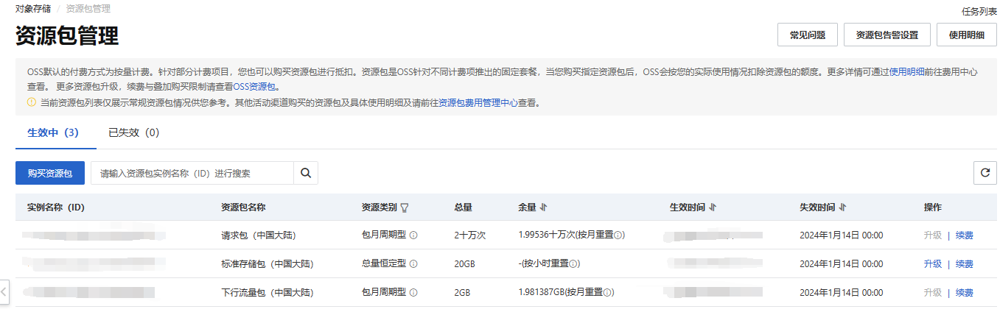
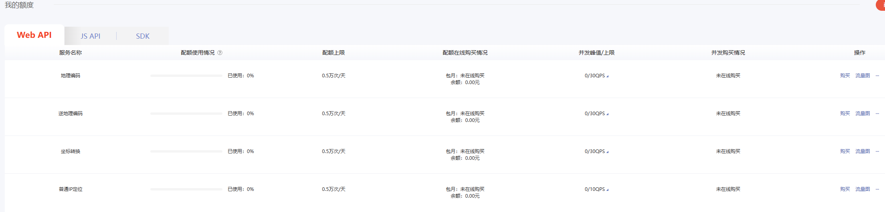

# 苍穹外卖

本项目是使用 Spring Boot 框架开发的一个在线外卖订购系统（无商户号跳过微信支付版）。

## 技术栈

- 后端框架
  - SpringBoot (3.1.2)
  - mybatis
- 数据库
  - MySql
  - Redis
- 前端框架
  - Vue
  - Uniapp

## Windows 开发环境搭建

安装 Java 并配置环境变量

创建 MySQL 数据库与表: 运行 [sky_take_out.sql](./资料/sky_take_out.sql)

安装 Maven 构建工具

克隆项目到本地	

```
https://github.com/xiachuanyoujia/sky-take-out.git
```


修改配置文件 [application.yml](./sky-server/src/main/resources/application.yml)

   ```yml
   spring:
     datasource:
       url: jdbc:mysql://url
       username: root
       password: 数据库密码
     data:
       redis:
         password: redis数据库密码
   ```

在 [resources](./sky-server/src/main/resources/) 目录下新建 `application-env.yml` 文件，写入以下配置

```yml
sky:
  wechat:
    appid: 申请微信小程序可获得
    secret: 申请微信小程序可获得
    mchid: 商户号
    mchSerialNo:
    privateKeyFilePath:
    apiV3Key:
    weChatPayCertFilePath:
    notifyUrl:
    refundNotifyUrl:
```

运行项目


### 用爱发电：（阿里oss、百度地图、小程序相关）

过期或者到达了使用量我都会直接停掉，介时不再提供，需要自己手动替换。

短期内提供自学是没有问题的（资料.zip中有黑马的资料和我改的跳过微信支付小程序）。

具体key在项目文件里

共勉！一起加油！



